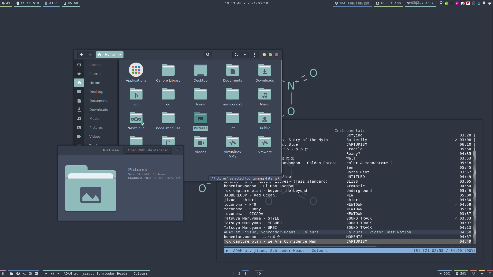
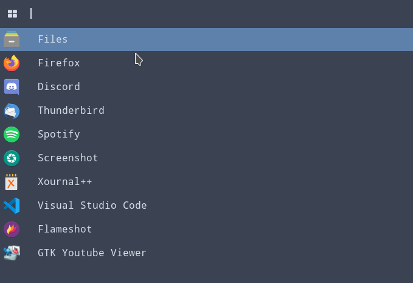
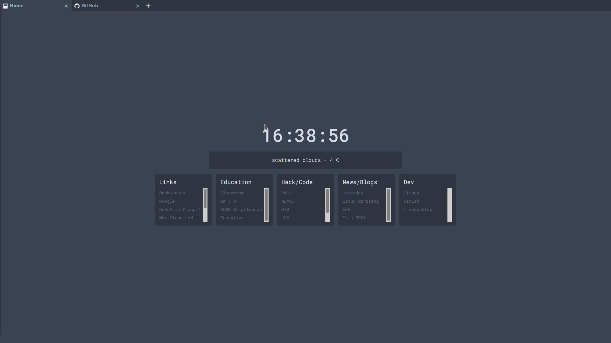

# dotfiles

Configuration files for my Arch Linux i3wm setup

## Software/Themes

**WM**: [i3-gaps](https://github.com/Airblader/i3)

**Icon Theme**: [Papirus Dark](https://github.com/PapirusDevelopmentTeam/papirus-icon-theme) + [Papirus Nord Folder Colors](https://github.com/Adapta-Projects/Papirus-Nord) (Folder colors switched using [papirus-folders](https://github.com/PapirusDevelopmentTeam/papirus-folders))

**GTK Theme**: [Nordic](https://github.com/EliverLara/Nordic/tree/v1.9.0)

**Terminal Emulator**: [kitty](https://sw.kovidgoyal.net/kitty/)

**Bars**: [polybar](https://github.com/polybar/polybar)

**App Launcher**: [rofi](https://archlinux.org/packages/community/x86_64/rofi/)

**Notification Center**: [deadd-notification-center](https://github.com/phuhl/linux_notification_center)

**File Manager**: [Nautilus/GNOME Files](https://gitlab.gnome.org/GNOME/nautilus) + [gnome-sushi](https://gitlab.gnome.org/GNOME/sushi) + [Nautilus Terminal](https://github.com/flozz/nautilus-terminal)

**Music Player** (Spotify): [ncspot](https://github.com/hrkfdn/ncspot)

### Other Software

* [flashfocus](https://github.com/fennerm/flashfocus)
* [picom](https://archlinux.org/packages/community/x86_64/picom/)
* [xfce4-power-manager](https://archlinux.org/packages/extra/x86_64/xfce4-power-manager/)
* [blueman](https://github.com/blueman-project/blueman)
* [kmix](https://archlinux.org/packages/extra/x86_64/kmix/)
* [udiskie](https://archlinux.org/packages/community/any/udiskie/)
* [feh](https://archlinux.org/packages/extra/x86_64/feh/)
* [playerctl](https://archlinux.org/packages/community/x86_64/playerctl/)
* [rofi-ykman](https://github.com/nukeop/rofi-ykman)
* [rofi-i3-keybinds](https://github.com/UserBlackBox/rofi-i3-keybinds)
* [rofimoji (matf fork)](https://git.teknik.io/matf/rofimoji/)

### Firefox Theme

`userChrome.css` and `userContent.css` can be found in the `firefox/chrome` folder

Firefox homepage is a modified version of [Jaredk3nt/homepage](https://github.com/Jaredk3nt/homepage) with custom links. The changed CSS can be found in `firefox/styles.css`

## Other Screenshots

Rofi Screenshot

Firefox `userChrome.css` and `userContent.css` theme

